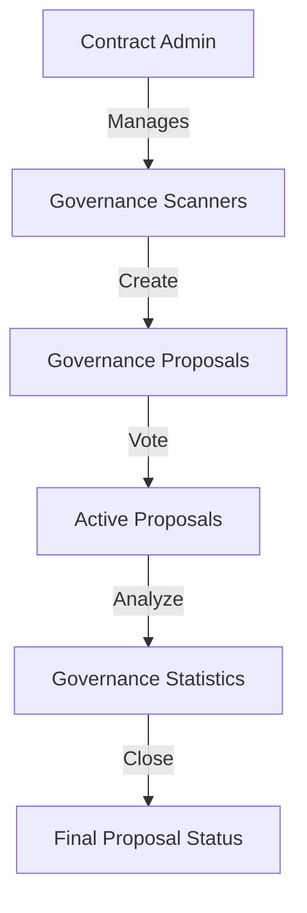

# Governance Scanner: Blockchain Governance Tracking Platform

A comprehensive and transparent system for tracking, analyzing, and managing governance interactions on the blockchain. Governance Scanner enables detailed monitoring of proposal lifecycles, voting mechanisms, and governance trends through an immutable and verifiable smart contract.

## Overview

Governance Scanner brings blockchain governance tracking on-chain through a comprehensive smart contract system that:
- Validates and registers governance scanners
- Creates a transparent proposal tracking mechanism
- Enables detailed voting and proposal management
- Maintains an immutable record of governance interactions
- Provides real-time analytics on governance activities

### Key Features
- Authorized scanner registration
- Proposal creation and lifecycle management
- Weighted voting system
- Comprehensive governance statistics
- Transparent proposal tracking
- Secure and verifiable governance processes

## Architecture

The system is built around a primary smart contract that manages the entire lifecycle of governance proposals and interactions.



### Core Components
1. **Governance System**: Contract admin manages authorized scanners
2. **Proposal Registry**: Tracks all governance proposals
3. **Voting Mechanism**: Enables weighted voting on proposals
4. **Analytics Layer**: Provides real-time governance insights
5. **Proposal Closure System**: Determines proposal outcomes

## Contract Documentation

### Core Functionality

#### Access Control
- `contract-admin`: Administrator managing governance scanners
- `authorized-scanners`: Entities permitted to create proposals
- `governance-proposals`: Detailed tracking of all proposals

#### Proposal Lifecycle
Each proposal contains:
- Creator information
- Proposal title and description
- Voting period details
- Current voting status
- Vote tallies and total voting power

## Getting Started

### Prerequisites
- Clarinet
- Stacks wallet
- Basic understanding of blockchain governance

### Basic Usage

1. **Creating a Proposal**
```clarity
(contract-call? .governance-scanner create-proposal
    "Infrastructure Upgrade" ; title
    "Proposal to upgrade network infrastructure..." ; description
    u500 ; voting period (in blocks)
)
```

2. **Casting a Vote**
```clarity
(contract-call? .governance-scanner cast-vote
    u1 ; proposal-id
    true ; vote direction (true = for, false = against)
    u100 ; vote weight
)
```

3. **Closing a Proposal**
```clarity
(contract-call? .governance-scanner close-proposal u1)
```

## Function Reference

### Administrative Functions
- `transfer-admin(new-admin)`
- `register-scanner(scanner)`

### Proposal Management
- `create-proposal(title, description, voting-period)`
- `cast-vote(proposal-id, vote, vote-weight)`
- `close-proposal(proposal-id)`

### Query Functions
- `get-proposal-details(proposal-id)`
- `get-governance-stats()`

## Development

### Testing
Run the test suite using Clarinet:
```bash
clarinet test
```

### Local Development
1. Clone the repository
2. Install dependencies with `clarinet requirements`
3. Start local development chain with `clarinet start`

## Security Considerations

### Key Safeguards
- Multi-level authorization system
- Strict proposal and voting validation
- Prevention of duplicate votes
- Transparent governance tracking

### Limitations
- Voting power management is basic
- Relies on block-height for timing
- No delegation of voting rights
- Simple binary voting mechanism